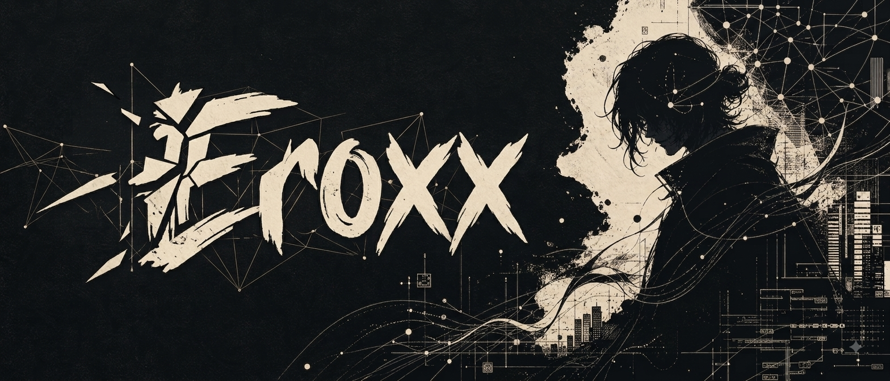
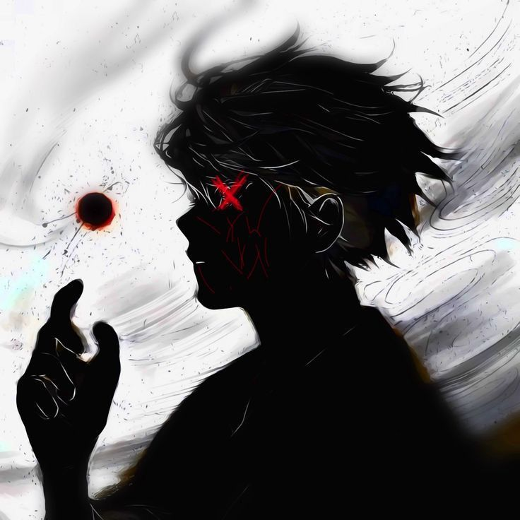
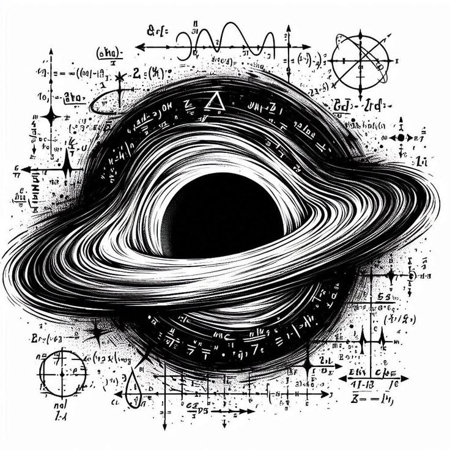
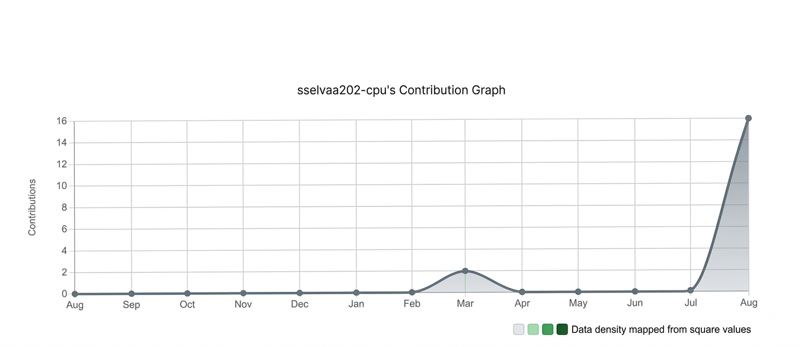

<!-- Top Banner Image -->

 
 

<!-- Sub-header Badge / Stats -->

 

---

## Know About Me

<table>
<tr>
<td width="35%" align="center" valign="middle">

<!-- Brain / Tech Accent Image -->

</td>
<td width="65%" valign="middle">

### Hey there! I'm Selvaa

I'm a developer focused on **artificial intelligence, backend systems, and modern software architecture**. I am especially interested in building software in which specialized components cooperate through clear interfaces instead of treating every problem as one generic model call.

My technical focus includes **LLMs, multi-agent systems, RAG, vector databases, Python, FastAPI, PostgreSQL, Redis, Docker, and Next.js**.

> *I am learning, building, breaking, and rebuilding systems until the architecture becomes clearer than the original idea.*

</td>
</tr>
</table>

---

## Top Projects

<table>
<tr>
<td width="70%" valign="top">

* **[AETHEROS](https://github.com/sselvaa202-cpu/AetherOS)** &nbsp; Enterprise multi-agent AI operating platform for coding, research, and enterprise operations.
 

* **[HIRECRAFT](https://github.com/sselvaa202-cpu/HireCraft)** &nbsp; AI-powered career alignment platform connecting job descriptions with skills and gap analysis.
 

* **[TRADEHUB](https://github.com/sselvaa202-cpu/tradershub)** &nbsp; Full-stack trading education platform with interactive learner journeys and structured courses.
 

* **[03:00 AM](https://github.com/sselvaa202-cpu/03-00-Am)** &nbsp; Creative frontend experience about visual storytelling, built with lightweight responsive animations.

</td>
<td width="30%" align="center" valign="middle">

<!-- Project Accent Image (Flame / Icon) -->

</td>
</tr>
</table>

---

## Connect

 

> **Code is never finished. It only becomes slightly less terrible over time.**

*Building AI-powered software systems, one deliberate module at a time.*

---

## Contribution

<!-- Contribution Graph Image / Component -->

